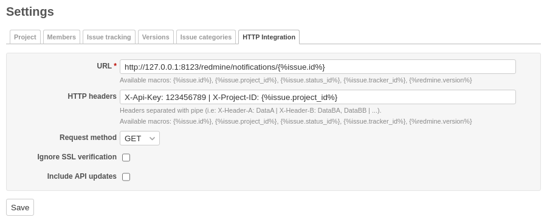

# Redmine HTTP integration

Issue update notifications to external URL.



## Features

- project specific configuration
- custom HTTP headers
- configurable method (GET, POST)
- option to allow insecure HTTPS connection (mainly for development)
- option to include notifications for issue updates over Redmine API

## Compatibility

Tested with Redmine deployments in table below.

| Redmine       | Ruby        | Rails    |
|---------------|-------------|----------|
| 5.0.5.stable  | 3.1.4-p223  | 6.1.7.2  |
| 4.2.10.stable | 2.7.8-p225  | 5.2.8.1  |
| 3.4.13.stable | 2.4.10-p364 | 4.2.11.1 |
| 2.6.10.stable | 2.2.5-p319  | 3.2.22.2 |
| 2.3.0.stable  | 1.8.7       | 3.2.13   |

## Setup

```sh
RAILS_ENV=production bundle exec rake redmine:plugins:migrate
```

## Limitations

Only individual issue updates are processed. To provide same functionality for bulk editing, issue controller in Redmine needs to be patched.

```diff
--- a/app/controllers/issues_controller.rb
+++ b/app/controllers/issues_controller.rb
@@ -323,6 +323,7 @@
       call_hook(:controller_issues_bulk_edit_before_save, { :params => params, :issue => issue })
       if issue.save
         saved_issues << issue
+        call_hook(:controller_issues_bulk_edit_after_save, { :params => params, :issue => issue, :journal => journal })
       else
         unsaved_issues << orig_issue
       end
```

Note: Line numbers from patch above may be different across Redmine versions.

## License

Licensed under MIT License.
